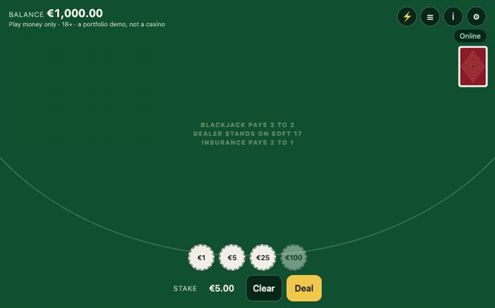

# Blackjack

A **single-player blackjack table** — stake, deal, insurance under an ace, then hit, stand, double
and split to four hands until the dealer plays. Node + TypeScript on the server, PixiJS + GSAP in the
browser, one HTTP request per decision.

**▶ [Play the live demo](https://blackjack-demo.onrender.com/)** — play money, on a phone or a desktop. Free hosting: the first
visit after a quiet spell takes about a minute to wake the server, and every wake is a fresh table
([ADR-0003](docs/adr/ADR-0003-demo-host.md)).



_Recorded from the E2E suite's forced shoe ([`e2e/forced.spec.ts`](e2e/forced.spec.ts)), at the
table's own pace: three splits, a double on 11, the dealer drawing to 25. Each card leaves the shoe
after the server has answered, never before._

## Try to break it

1. **Play a hand with a split.** Deal until a pair comes; press **Split** (or `P`).
2. **Break the network mid-hand.** Open the lab (⚡): *Lose the next reply* makes the server apply
   your next move and hang up without answering; *This browser offline* cuts you off; *Refuse the
   next 5 requests*, *Lose 30 % of replies* and up to 3 s of latency do what they say. Press a move,
   watch **Reconnecting…**, turn the network back on.
3. **Verify the hand you just played.** Open the history (☰) and press **Verify** on it. The page
   rebuilds the six-deck shoe from the two seeds, checks the server's seed against the commit you
   were shown before you bet, checks the seed your browser sent, and replays your decisions
   through the same engine the server ran — card by card, in your browser. Copy its address and
   anyone can open it: they get every check but "this browser sent that seed", which only you can
   vouch for. A link lasts as long as the demo's current boot.

The E2E suite does exactly this as a stranger would, against the live demo too
(`E2E_BASE_URL=… pnpm e2e:live`): open, split, break, recover, verify — in about 30 seconds.

## What makes it interesting to build

Not the felt. The gap between what the server knows and what the screen shows.

- **A round is a tree of decisions**, each a round trip: split into up to four hands, double on any
  of them, insurance under an ace. Every request names the version of the hand it was decided on and
  carries its own idempotency key, so a double tap, a second tab or a lost reply never becomes a
  second card.
- **Face-down never travels.** The dealer's hole card is not in the browser until it turns — not in
  a reply, a log line or DevTools.
- **The client computes nothing that decides or moves money.** `allowed` moves, stakes, payouts and
  the balance arrive in the server's snapshot; the browser's one piece of game logic is reading a
  total off cards it was shown.

### The two decisions everything hangs on

**[ADR-0001](docs/adr/ADR-0001-committed-shoe.md) — the shoe is committed before the bet and
shuffled with the player's seed.** Before you choose a stake, the server publishes the SHA-256 of
the seed it will deal your next round from. Your browser sends a seed of its own with the bet, and
six decks are shuffled from both by an HMAC-driven Fisher–Yates, fresh every round. When the hand
settles the server seed is revealed — and the verifier can show that the shoe was fixed before you
bet, that you helped shuffle it, and that the cards and the payouts follow from your decisions.
The shuffle is pinned by an independent Python implementation, byte for byte.

**[ADR-0002](docs/adr/ADR-0002-presentation-lags-truth.md) — the presentation lags the truth, and
never leads it.** The server answers a stand in milliseconds; the dealer turning the hole card,
drawing three cards and the hands settling left to right take seconds to *see*. So the reply is
applied at once, as the truth, and a pure `director` turns its events into a script the stage plays
on one clock. A button opens only for a decision the screen has already shown, the balance climbs
only when the winning card lands, and a skip, a reload, a hidden tab or a resize draw the truth as
it stands. The one optimistic thing is a Double's chips, sent at the press and sent back on a
refusal. How the pieces fit: [`docs/architecture.md`](docs/architecture.md).

### Is it really blackjack? — the edge

Basic strategy played through the engine, every round from the protocol's own shuffle of a fresh
six-deck shoe ([`tools/sim`](tools/sim), [`docs/sim/`](docs/sim/README.md)):

| Run | Rounds | House edge (±1σ) | vs published 0.40622 % |
| --- | --- | --- | --- |
| `blackjack-sim` | 10⁷ | 0.4987 % ± 0.0365 % | +2.53σ |
| `second-run` | 10⁷ | 0.4238 % ± 0.0365 % | +0.48σ |
| `third-run` | 10⁷ | 0.4215 % ± 0.0365 % | +0.42σ |
| **pooled** | **3 · 10⁷** | **0.4480 % ± 0.0211 %** | **+1.98σ** |

Published: Wizard of Odds' calculator for these rules (6 decks, S17, DAS, resplit to 4, 3:2, a
continuous shuffler). Every run is within 3σ; the pooled 2σ excess is almost all the first run,
and it is kept as an open question rather than rounded away. Every pair cell of the strategy chart
is also measured against the engine — all 110 hold.

### How it is held to account

- **A 30-minute soak** — 200 sessions, faults on most of them, two tabs on some, the server
  `SIGKILL`ed every five minutes — audited over the wire to zero findings: every wallet equal to its
  rounds, every accepted move recorded once, every card dealt once ([`docs/load/`](docs/load/README.md)).
- **Choreography by property**: 5,000 random rounds whose scripts all end on the snapshot's
  picture; skipping from any cue lands where watching does.
- **E2E in CI** (Playwright, on a phone): a forced pair split into four hands, every payout asserted
  on screen and in the balance; a stranger's split broken and verified — and the same stranger
  against the Docker image Render deploys.

## Running it

```bash
pnpm install
pnpm dev        # the server (forced shoes allowed) and the page on http://localhost:5173
pnpm check      # lint, build, typecheck, every test — what CI runs
pnpm e2e        # the E2E suite against a local server (needs `pnpm exec playwright install chromium`)
```

`docker build -t blackjack . && docker run -p 8080:8080 -e BJ_FAULTS=on blackjack` runs the image the
demo runs. `pnpm sim`, `pnpm load` and the browser probes are described in [`CLAUDE.md`](CLAUDE.md).

## Documents

| File | What it is |
| --- | --- |
| [`CLAUDE.md`](CLAUDE.md) | The canon — packages, rules, commands. Kept current as code lands. |
| [`ROADMAP.md`](ROADMAP.md) | The task map — blocks, gates, `Done when`, and what each measured. |
| [`docs/protocol.md`](docs/protocol.md) | The wire contract — every endpoint, reply and event, the shuffle, the rules. |
| [`docs/architecture.md`](docs/architecture.md) | The request path, the transaction, truth · script · stage. |
| [`docs/adr/`](docs/adr) | The decisions everything else is downstream of. |

Play money only. No real money, no payments, no crypto — a visible 18+/demo notice instead.
