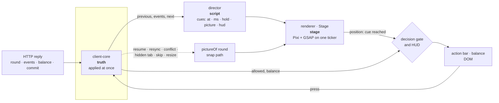

# Architecture

Three pictures of one system: a decision's **request path**, from a button to a row and back; the
**transaction** that makes that path safe to repeat; and the client's **truth, script and stage** —
how an answer that is already final gets shown at a human pace without ever being shown early.
The why behind each is in the two ADRs ([0001](adr/ADR-0001-committed-shoe.md),
[0002](adr/ADR-0002-presentation-lags-truth.md)); the wire is [`protocol.md`](protocol.md); the
deploy is [ADR-0003](adr/ADR-0003-demo-host.md).

```
packages/  money · cards · fair · protocol · engine · strategy      ← pure: no clock, no I/O
           client-core · director · renderer                         ← the client, layer by layer
apps/      server (Fastify + SQLite) · web (Vite, Pixi, DOM)
tools/     sim (the edge, 10⁷ rounds) · load (the soak, over the wire)
```

## 1. The request path — one decision

A player presses **Stand** on hand 2 of 3.

```mermaid
sequenceDiagram
  autonumber
  participant B as Action bar (DOM)
  participant T as TableController
  participant C as client-core
  participant H as http.ts (Fastify)
  participant X as Table
  participant E as engine
  participant S as SQLite

  B->>T: press (only lit if the gate is open and `allowed` has it)
  T->>C: act('stand')
  Note over C: one request in flight; a fresh actionId,<br/>the round's seq — kept for every retry
  C->>H: POST /api/act {actionId, roundId, seq, action}
  H->>H: faults for this session (§9) — wait, refuse, or later drop
  H->>X: act(token, body) — synchronous from here to the commit
  X->>S: the session, and a stored reply for this actionId?
  alt a retry
    S-->>X: the stored reply, byte for byte
  else new
    X->>S: the open round's row — its inputs
    X->>E: replay(seeds, stake, decisions, shoe(serverSeed, clientSeed))
    X->>X: roundId and seq current? else CONFLICT with the round as it is
    X->>E: act(state, 'stand', shoe) → state, events (or a refusal)
    X->>S: ONE transaction — round inputs, wallet, next seed, reply
  end
  X-->>H: Answer {status, body}
  H-->>C: 200 ActionReply {round, events, balance, commit}
  C->>C: parse (zod) · dev: fold(previous, events) == round · replace the truth
  C-->>T: change (previous, events, next)
  T->>T: director → Script; Stage.play(cues); gate and HUD follow the playback
```

What the shape buys:

- **The server never holds a round in memory.** A row is the round's *inputs* — rules, seeds,
  stake, opening balance, decisions — and every request rebuilds the state with `engine.replay`,
  the same function the verifier runs in a browser. Resume after a restart is not a separate path;
  it is the only path.
- **Nothing awaits between the first read and the commit** (better-sqlite3 is synchronous), so two
  tabs' requests on one session are serialised by the event loop: the second reads what the first
  wrote, and its stale `seq` is a `CONFLICT` that carries the round as it now is.
- **Faults wrap the table call, never enter it.** Latency and refusals come before it; a dropped
  reply is one that was applied and stored and then not sent — exactly the case §7's `actionId`
  exists for.
- **A retry is the same request.** `client-core` re-sends the same body under the same `actionId`
  after silence or `SYSTEM`; the server answers it from the stored reply. (So does Chromium, on its
  own, when a POST on a reused keep-alive socket is cut before any byte comes back — same body, same
  answer. The E2E suite's stranger meets both.)

## 2. The transaction

`Table.accept` is the one write in the game. An accepted deal or decision commits, in a single
SQLite transaction, **before** any byte of the reply is sent:

| Row | What changes | Why it must be in the same transaction |
| --- | --- | --- |
| `rounds` | the decision appended (or the round inserted, on a deal); `settledAt` if it settled | the round's inputs are its truth — replayable, verifiable |
| `sessions` | the balance; `openRound`; on a settle, a **fresh server seed** and `lastSettled` | money moves with the hand that moved it, and the next commit is published with the settle |
| `replies` | the reply body, keyed by `(token, actionId)`, with the request's fingerprint | a retry gets this reply; another body under the same id is `ACTION_ID_REUSED` |

Kill the process at any instant and one of two things is true: the transaction committed, and a
retry is answered from `replies`; or it did not, and the retry applies the decision for the first
time. There is no third state — no wallet debited for a card the round never got, no card in a
round whose reply cannot be found. `pnpm load` holds this to account: 200 sessions for 30 minutes,
faults on most of them, the server `SIGKILL`ed every five minutes, and every wallet, deal, decision
and card audited over the wire afterwards ([`docs/load/`](load/README.md)).

The order inside a request is §7's: **session → `actionId` replay → `seq` → rules**. A retry of an
action that succeeded is answered by its own reply, not by a conflict with the version it created.

## 3. Truth, script, stage — the client



- **Truth** is the last snapshot the server sent, replaced whole on every reply. Nothing on screen
  is computed from anything else: `allowed`, stakes, payouts and the balance all arrive in it.
- **The script** is data: `direct(previous, events, next)` returns cues, each with the picture the
  table shows after it and the balance the HUD may show by then. Every script is proved (5,000
  random rounds) to end on `pictureOf(next)` — the picture the snap path draws.
- **The stage** plays the cues. The **gate** opens a button only when the playback has reached the
  cue where that decision is on screen and the truth's `allowed` has it; the **HUD** climbs only at
  the settle cue. A skip, a hidden tab, a resync, a conflict, a reload and a resize all take the
  dotted path: draw the truth as it stands, no catch-up animation.
- **The one optimistic thing** is a Double's or a Split's chips, which leave at the press
  (`Stage.propose`) and are taken in by the reply's cue or sent back with the reason in words. A
  card never moves before its reply: the renderer can only deal what the director scripted, and the
  director only scripts what the server sent.

## Where it runs

One image ([`Dockerfile`](../Dockerfile)): `apps/server` serves `/api/*`, `/fair/*` and the built web
app from one origin, on Render's free tier ([`render.yaml`](../render.yaml)) — no disk, so every boot
is a fresh table ([ADR-0003](adr/ADR-0003-demo-host.md)). CI runs `pnpm check`, the E2E suite
against a development server (a forced four-hand split; a stranger's split broken and verified),
and the same stranger against the built image; Render deploys only a commit that passed.
